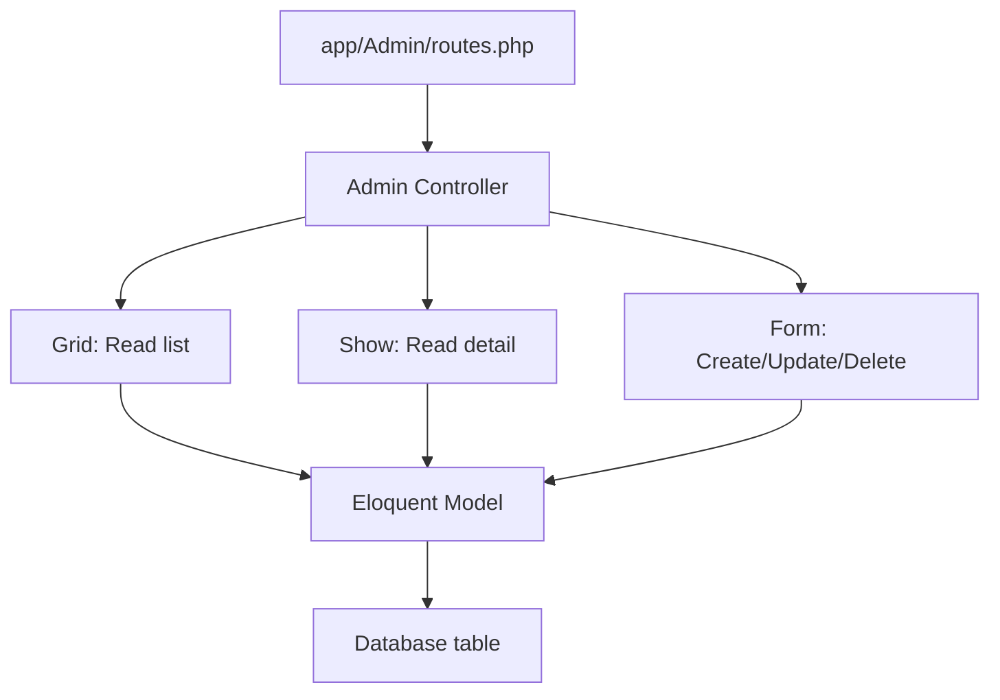
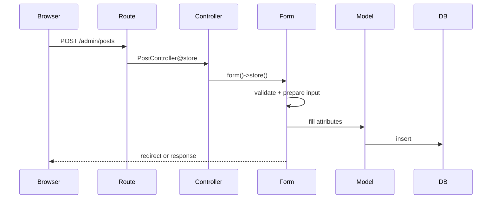
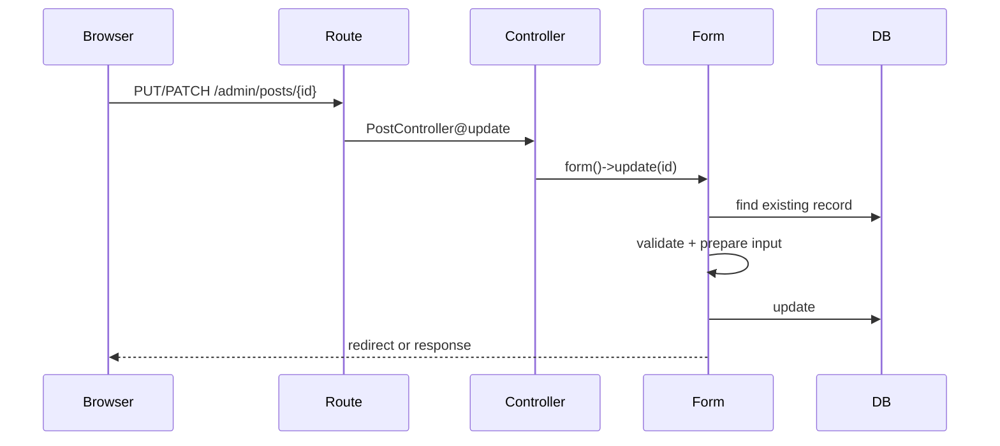

# 数据库操作与 CRUD

本文说明在 `laravel-admin` 中如何围绕 Eloquent model 完成数据库 CRUD 操作。这里的 CRUD 指：

- Create：创建记录
- Read：读取列表与详情
- Update：更新记录
- Delete：删除记录

`laravel-admin` 不直接替代 Laravel 的数据库层。它使用 Laravel Eloquent、Query Builder、validation、migration、transaction 等能力，并通过 `Grid`、`Form`、`Show` 与 resource controller 把数据库操作组织成后台页面。

## 基本数据流

一个标准后台 CRUD 页面通常由四层组成：



典型文件关系：

```text
app/
├── Admin/
│   ├── Controllers/
│   │   └── PostController.php
│   └── routes.php
└── Models/
    └── Post.php

database/
└── migrations/
    └── xxxx_xx_xx_xxxxxx_create_posts_table.php
```

## 准备数据表与模型

先用 Laravel migration 建表，再建立 Eloquent model。

```bash
php artisan make:model Post -m
```

示例 migration：

```php
use Illuminate\Database\Migrations\Migration;
use Illuminate\Database\Schema\Blueprint;
use Illuminate\Support\Facades\Schema;

return new class extends Migration
{
    public function up()
    {
        Schema::create('posts', function (Blueprint $table) {
            $table->id();
            $table->string('title');
            $table->text('body')->nullable();
            $table->boolean('published')->default(false);
            $table->timestamp('published_at')->nullable();
            $table->timestamps();
        });
    }

    public function down()
    {
        Schema::dropIfExists('posts');
    }
};
```

执行迁移：

```bash
php artisan migrate
```

示例 model：

```php
namespace App\Models;

use Illuminate\Database\Eloquent\Model;

class Post extends Model
{
    protected $fillable = [
        'title',
        'body',
        'published',
        'published_at',
    ];

    protected $casts = [
        'published' => 'boolean',
        'published_at' => 'datetime',
    ];
}
```

## 注册后台路由

在 `app/Admin/routes.php` 中注册 resource route：

```php
use App\Admin\Controllers\PostController;

$router->resource('posts', PostController::class);
```

如果后台前缀是默认 `admin`，则访问路径为：

```text
/admin/posts
/admin/posts/create
/admin/posts/{id}
/admin/posts/{id}/edit
```

## 创建 Controller

可以使用命令生成：

```bash
php artisan admin:make PostController --model=App\\Models\\Post
```

也可以手写：

```php
namespace App\Admin\Controllers;

use App\Models\Post;
use Encore\Admin\Controllers\AdminController;
use Encore\Admin\Form;
use Encore\Admin\Grid;
use Encore\Admin\Show;

class PostController extends AdminController
{
    protected $title = 'Posts';

    protected function grid()
    {
        $grid = new Grid(new Post());

        $grid->column('id', 'ID')->sortable();
        $grid->column('title', '标题');
        $grid->column('published', '已发布')->bool();
        $grid->column('published_at', '发布时间');
        $grid->column('created_at', '创建时间');
        $grid->column('updated_at', '更新时间');

        return $grid;
    }

    protected function detail($id)
    {
        $show = new Show(Post::findOrFail($id));

        $show->field('id', 'ID');
        $show->field('title', '标题');
        $show->field('body', '内容');
        $show->field('published', '已发布');
        $show->field('published_at', '发布时间');
        $show->field('created_at', '创建时间');
        $show->field('updated_at', '更新时间');

        return $show;
    }

    protected function form()
    {
        $form = new Form(new Post());

        $form->display('id', 'ID');
        $form->text('title', '标题')->rules('required|max:255');
        $form->textarea('body', '内容');
        $form->switch('published', '已发布');
        $form->datetime('published_at', '发布时间');
        $form->display('created_at', '创建时间');
        $form->display('updated_at', '更新时间');

        return $form;
    }
}
```

## Read：列表读取

列表读取由 `Grid` 负责。最常见操作是添加列、设置排序、修改查询条件与添加筛选器。

```php
protected function grid()
{
    $grid = new Grid(new Post());

    $grid->model()->orderBy('id', 'desc');

    $grid->column('id', 'ID')->sortable();
    $grid->column('title', '标题')->limit(40);
    $grid->column('published', '已发布')->bool();
    $grid->column('created_at', '创建时间')->sortable();

    $grid->filter(function (Grid\Filter $filter) {
        $filter->like('title', '标题');
        $filter->equal('published', '发布状态')->select([
            0 => '未发布',
            1 => '已发布',
        ]);
        $filter->between('created_at', '创建时间')->datetime();
    });

    return $grid;
}
```

常用读取控制：

```php
$grid->model()->where('published', true);
$grid->model()->whereIn('id', [1, 2, 3]);
$grid->model()->with('author');
$grid->model()->orderBy('created_at', 'desc');
$grid->paginate(30);
```

如果要显示关联数据，应优先在 Eloquent model 中定义关系，再在 Grid 中读取：

```php
// App\Models\Post
public function author()
{
    return $this->belongsTo(User::class, 'user_id');
}

// Grid
$grid->column('author.name', '作者');
```

## Read：详情读取

详情读取由 `Show` 负责，适合展示单笔记录与关联数据。

```php
protected function detail($id)
{
    $show = new Show(Post::findOrFail($id));

    $show->field('id', 'ID');
    $show->field('title', '标题');
    $show->field('body', '内容');
    $show->field('published', '已发布')->using([
        0 => '否',
        1 => '是',
    ]);

    $show->author('作者', function (Show $author) {
        $author->field('name', '姓名');
        $author->field('email', '邮箱');
    });

    return $show;
}
```

对一对多或多对多关系，可以在 `Show` 中嵌入 Grid：

```php
$show->comments('评论', function (Grid $comments) {
    $comments->resource('/admin/comments');
    $comments->column('id');
    $comments->column('body');
    $comments->column('created_at');
});
```

## Create：创建记录

创建记录由 `Form::store()` 完成。开发者通常只需要在 `form()` 中定义字段、验证与保存 hook。

```php
protected function form()
{
    $form = new Form(new Post());

    $form->text('title', '标题')
        ->rules('required|max:255');

    $form->textarea('body', '内容');

    $form->switch('published', '已发布')
        ->default(false);

    $form->datetime('published_at', '发布时间');

    $form->saving(function (Form $form) {
        if ($form->published && empty($form->published_at)) {
            $form->published_at = now();
        }
    });

    return $form;
}
```

创建请求流程：



## Update：更新记录

更新记录由 `Form::update($id)` 完成。

```php
protected function form()
{
    $form = new Form(new Post());

    $form->text('title', '标题')
        ->rules('required|max:255');

    $form->textarea('body', '内容');
    $form->switch('published', '已发布');
    $form->datetime('published_at', '发布时间');

    $form->updating(function (Form $form) {
        if (!$form->published) {
            $form->published_at = null;
        }
    });

    return $form;
}
```

更新请求流程：



## Delete：删除记录

删除记录由 `Form::destroy($id)` 完成。Resource route 的 `DELETE /admin/posts/{id}` 会进入 controller 的 `destroy($id)`，再委派给 Form。

默认删除是真删除：

```php
public function destroy($id)
{
    return $this->form()->destroy($id);
}
```

如果 model 使用 Laravel `SoftDeletes`，则删除会变成软删除：

```php
use Illuminate\Database\Eloquent\Model;
use Illuminate\Database\Eloquent\SoftDeletes;

class Post extends Model
{
    use SoftDeletes;
}
```

对应 migration 需要：

```php
$table->softDeletes();
```

列表中通常可以按需求控制删除按钮：

```php
$grid->actions(function (Grid\Displayers\Actions $actions) {
    if ($actions->getKey() == 1) {
        $actions->disableDelete();
    }
});

$grid->tools(function (Grid\Tools $tools) {
    $tools->batch(function (Grid\Tools\BatchActions $actions) {
        $actions->disableDelete();
    });
});
```

## 字段与数据库列的对应关系

Form 字段名默认对应 model attribute，也就是数据库列名：

```php
$form->text('title');        // posts.title
$form->textarea('body');     // posts.body
$form->switch('published');  // posts.published
```

如果字段只用于页面输入，不应写入数据库，使用 `ignore()`：

```php
$form->password('password_confirmation');
$form->ignore(['password_confirmation']);
```

如果字段需要在保存前转换，使用 `saving()`：

```php
use Illuminate\Support\Facades\Hash;

$form->password('password');

$form->saving(function (Form $form) {
    if ($form->password) {
        $form->password = Hash::make($form->password);
    }
});
```

内建 `UserController` 就使用这种方式处理后台用户密码。

## 关联数据操作

### belongsTo

model：

```php
class Post extends Model
{
    public function author()
    {
        return $this->belongsTo(User::class, 'user_id');
    }
}
```

Form：

```php
$form->select('user_id', '作者')
    ->options(User::all()->pluck('name', 'id'));
```

Grid：

```php
$grid->column('author.name', '作者');
```

### belongsToMany

model：

```php
class Post extends Model
{
    public function tags()
    {
        return $this->belongsToMany(Tag::class, 'post_tag');
    }
}
```

Form：

```php
$form->multipleSelect('tags', '标签')
    ->options(Tag::all()->pluck('name', 'id'));
```

Grid：

```php
$grid->column('tags', '标签')->pluck('name')->label();
```

`multipleSelect('tags')` 的字段名应与 Eloquent relation 方法名一致，这样 Form 才能保存关联表。

### hasMany

model：

```php
class Post extends Model
{
    public function comments()
    {
        return $this->hasMany(Comment::class);
    }
}
```

Form：

```php
$form->hasMany('comments', '评论', function (Form\NestedForm $form) {
    $form->textarea('body', '内容');
});
```

`hasMany` 会把子表单数据写入关联表。实际使用时要确认外键、fillable、验证规则与删除策略。

## 查询过滤与性能

常见性能问题通常来自 N+1 查询、过大的分页或在 `display()` 中逐行查询数据库。

推荐做法：

```php
// 预加载关联，避免每行查询一次
$grid->model()->with('author');

// 限制默认排序与分页
$grid->model()->orderBy('id', 'desc');
$grid->paginate(20);

// 对经常过滤的字段加数据库索引
$filter->equal('status');
$filter->between('created_at')->datetime();
```

避免：

```php
$grid->column('user_id')->display(function ($userId) {
    return User::find($userId)->name; // 每行一次查询，数据多时会慢
});
```

改为：

```php
$grid->model()->with('user');
$grid->column('user.name', '用户');
```

## 事务与复杂保存

`Form` 的保存过程会处理 model 与关联字段。对于更复杂的跨表写入，可以使用 hook 搭配 Laravel transaction：

```php
use Illuminate\Support\Facades\DB;

$form->saving(function (Form $form) {
    DB::transaction(function () use ($form) {
        // 复杂写入逻辑
    });
});
```

如果需要完全自定义写入流程，应谨慎处理：

- validation
- mass assignment
- relation save
- transaction
- exception response
- redirect
- operation log

## 权限与数据库操作

数据库 CRUD 页面通常还需要配合权限：

1. 在后台权限管理中创建 permission。
2. 设置 `http_method` 与 `http_path`。
3. 绑定到角色或用户。
4. 在菜单中绑定对应 permission。

示例：

```text
name: Post management
slug: posts
http_method: GET,POST,PUT,DELETE
http_path: /posts*
```

如果 `config('admin.check_route_permission')` 为 `true`，未授权用户访问对应 route 会被拒绝。

## 常见问题

### 创建或更新后字段没有保存

检查：

- model 是否允许 mass assignment，例如 `$fillable`。
- Form 字段名是否与数据库列名一致。
- 是否调用了 `$form->ignore()`。
- 是否有 mutator、saving hook 或 prepare 逻辑覆盖了值。

### 关联字段没有保存

检查：

- 字段名是否与 Eloquent relation 方法名一致。
- relation 是否正确定义。
- pivot table 或 foreign key 是否存在。
- model 是否配置了正确 connection/table。

### 列表很慢

检查：

- `display()` 中是否逐行查询。
- 是否需要 `with()` 预加载关联。
- 筛选字段是否缺少索引。
- 分页是否过大。

### 删除后数据消失还是软删除

取决于 model 是否使用 `SoftDeletes`。使用软删除时，migration 必须有 `deleted_at` 字段。

### 后台用户、角色、权限操作的是哪些表

默认使用：

- `admin_users`
- `admin_roles`
- `admin_permissions`
- `admin_menu`
- `admin_operation_log`
- `admin_role_users`
- `admin_role_permissions`
- `admin_user_permissions`
- `admin_role_menu`

这些表名与模型都可在 `config/admin.php` 的 `database` 区块中调整。
