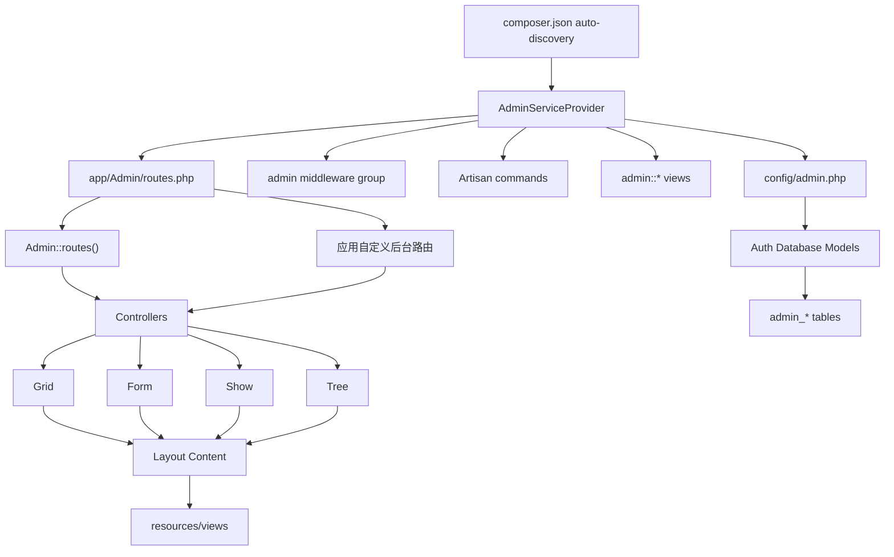
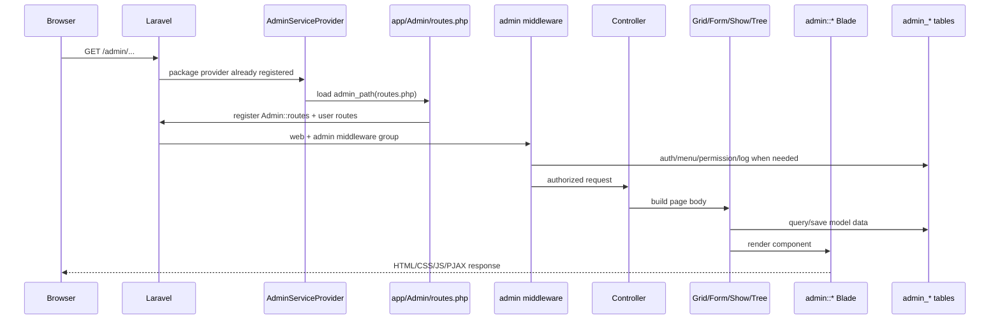
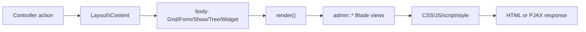
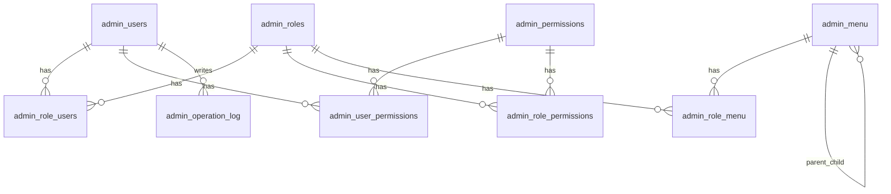
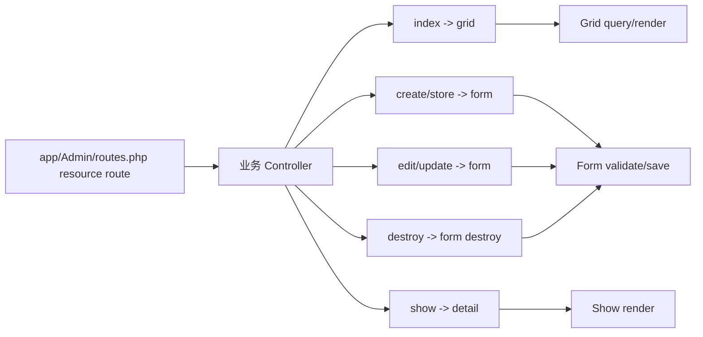

# 系统架构

本文面向需要维护、扩展或排查 `laravel-admin` 的工程师，说明这个包如何接入 Laravel、如何注册后台路由、如何处理一次后台请求，以及 Grid、Form、Show、Tree、权限、资产与命令行工具之间的关系。

## 总览

`laravel-admin` 是一个 Laravel package，不是独立应用。它通过 Composer 自动发现注册 `Encore\Admin\AdminServiceProvider`，再把后台所需的路由、中间件、视图、配置、迁移、静态资源与 Artisan 命令接入宿主 Laravel 应用。

核心设计可以概括为：

- `AdminServiceProvider` 负责 Laravel 集成入口。
- `Admin` facade 负责后台运行期能力：内置路由、菜单、认证 guard、启动回调、资产注册。
- `app/Admin/routes.php` 是安装后应用侧的后台路由入口。
- `app/Admin/bootstrap.php` 是安装后应用侧的后台启动扩展点。
- `Grid`、`Form`、`Show`、`Tree` 是面向 Eloquent model 的页面构建器。
- `Auth\Database` 下的模型与迁移提供内置 RBAC、菜单与操作日志。
- `resources/views` 与 `resources/assets` 提供 AdminLTE 风格的渲染层与前端资源。



## 目录职责

| 路径 | 职责 |
| --- | --- |
| `src/AdminServiceProvider.php` | Laravel package 入口。注册中间件、命令、路由宏；启动时载入视图、应用后台路由、可发布资源与 Blade directive。 |
| `src/Admin.php` | 核心 facade 实作。注册内置后台路由、读取菜单、取得 admin guard、执行后台 bootstrap、注册 CSS/JS/script。 |
| `src/Facades/Admin.php` | Laravel facade，accessor 为 `Encore\Admin\Admin::class`。 |
| `src/Controllers/` | 内置后台资源控制器。用户、角色、权限、菜单、日志、登录与 handle endpoints 都在这里。 |
| `src/Grid.php` 与 `src/Grid/` | 列表构建器。处理查询、列、筛选器、工具栏、行操作、批量操作、导出与显示器。 |
| `src/Form.php` 与 `src/Form/` | 表单构建器。处理字段、验证、hooks、store/update/destroy、关联保存与字段资产。 |
| `src/Show.php` 与 `src/Show/` | 详情页构建器。处理字段、面板、关联展示，关联可嵌套 `Show` 或 `Grid`。 |
| `src/Tree.php` | 树状 UI 构建器，通常用于菜单管理，依赖模型使用 `ModelTree` trait。 |
| `src/Layout/` | 页面布局层。`Content` 管理 title、description、body，`Row/Column` 管理 Bootstrap 栅格。 |
| `src/Middleware/` | 后台请求管线：认证、权限、PJAX、操作日志、后台 bootstrap、session。 |
| `src/Auth/Database/` | 内置用户、角色、权限、菜单与操作日志模型。 |
| `src/Console/` | `admin:install`、`admin:publish`、`admin:make`、`admin:permissions` 等命令与 stubs。 |
| `src/Widgets/` | Box、Form、Tab、Navbar、Table 等可嵌入 UI 组件。 |
| `src/Actions/` | 行操作、批量操作与交互式 action response/dialog/form。 |
| `src/Traits/` | 共用能力，例如 `ModelTree`、资产管理、日期格式与 builder 行为。 |
| `src/helpers.php` | 全局 helper，例如 `admin_path()`、`admin_url()`、`admin_asset()`。 |
| `config/admin.php` | 后台路由、认证、数据库表、上传、权限、菜单、UI、扩展与资产配置。 |
| `database/migrations/` | 内置 `admin_*` 表结构。 |
| `resources/views/` | 后台 Blade 视图。 |
| `resources/assets/` | 发布到 `public/vendor/laravel-admin` 的前端资源。 |

## Package 入口与 Laravel 集成

Composer 负责把 package 接入宿主 Laravel：

- PSR-4：`Encore\Admin\` 映射到 `src/`。
- files autoload：载入 `src/helpers.php`。
- Laravel auto-discovery：
  - provider：`Encore\Admin\AdminServiceProvider`
  - alias：`Admin` -> `Encore\Admin\Facades\Admin`

`AdminServiceProvider::register()` 负责注册运行期能力：

1. `loadAdminAuthConfig()` 将 `config('admin.auth')` 展开写入 Laravel 的 `auth.*` 配置，让 `admin` guard/provider 生效。
2. `registerRouteMiddleware()` 注册 `admin.auth`、`admin.pjax`、`admin.log`、`admin.permission`、`admin.bootstrap`、`admin.session`，并组成 `admin` middleware group。
3. `commands()` 注册所有 `admin:*` Artisan 命令。
4. `macroRouter()` 给 Laravel router 增加 `content()` 与 `component()`，方便路由直接返回 `Layout\Content`。

`AdminServiceProvider::boot()` 负责启动时接线：

1. `loadViewsFrom(resources/views, 'admin')` 注册 `admin::*` 视图命名空间。
2. `ensureHttps()` 在 admin 路由下按配置强制 HTTPS。
3. 若 `admin_path('routes.php')` 存在，载入应用侧后台路由。
4. `registerPublishing()` 注册 config、lang、migration、assets 的发布规则。
5. `compatibleBlade()` 处理 Laravel 5.6 之后的 Blade double encoding。
6. 注册 `@box` / `@endbox` Blade directive。

## 安装后的应用侧结构

执行 `php artisan admin:install` 后，宿主应用会获得一个默认后台目录：

```text
app/Admin/
├── Controllers/
│   ├── AuthController.php
│   ├── ExampleController.php
│   └── HomeController.php
├── bootstrap.php
└── routes.php
```

`app/Admin/routes.php` 的典型结构是：

```php
Admin::routes();

Route::group([
    'prefix'     => config('admin.route.prefix'),
    'namespace'  => config('admin.route.namespace'),
    'middleware' => config('admin.route.middleware'),
    'as'         => config('admin.route.prefix') . '.',
], function (Router $router) {
    $router->get('/', 'HomeController@index')->name('home');
});
```

这里有两层路由：

- `Admin::routes()` 注册内置后台能力，例如登录、用户、角色、权限、菜单、操作日志与 handle endpoints。
- `Route::group(...)` 注册应用自己的后台页面，例如 dashboard、业务 CRUD 页面。

`app/Admin/bootstrap.php` 是运行期扩展点，默认会移除 `map` 与 `editor` 字段。常见用法包括：

- `Encore\Admin\Form::forget(...)` 移除内置字段。
- `Encore\Admin\Form::extend(...)` 注册自定义表单字段。
- `Admin::css(...)`、`Admin::js(...)`、`Admin::script(...)` 添加后台资产。
- `Admin::navbar(...)` 定制导航栏。

## 请求生命周期

一次访问 `/admin/...` 的请求大致如下：



`config('admin.route.middleware')` 默认是 `['web', 'admin']`，其中 `admin` group 的默认顺序为：

1. `admin.auth`
2. `admin.pjax`
3. `admin.log`
4. `admin.bootstrap`
5. `admin.permission`

各中间件职责：

- `Authenticate`：切换默认 auth guard 为 `admin`；未登录且不在 `auth.excepts` 中时跳转到登录页。
- `Pjax`：对 PJAX 请求/响应做适配。
- `LogOperation`：按 `operation_log` 配置写入操作日志。
- `Bootstrap`：执行 `Admin::bootstrap()`，载入 `app/Admin/bootstrap.php`，收集字段资产与启动回调。
- `Permission`：按当前用户角色/权限检查 HTTP method 与 path。
- `Session`：可选 session middleware，默认未启用。

## 路由模型

`Admin::routes()` 在 `config('admin.route.prefix')` 与 `config('admin.route.middleware')` 下注册内置路由：

- `auth/login`、`auth/logout`、`auth/setting`
- `auth/users`
- `auth/roles`
- `auth/permissions`
- `auth/menu`
- `auth/logs`
- `_handle_form_`
- `_handle_action_`
- `_handle_selectable_`
- `_handle_renderable_`

内置资源路由进入 `src/Controllers/*Controller.php`。业务页面通常由应用自己的 `app/Admin/Controllers/*Controller.php` 继承或参照 `Encore\Admin\Controllers\AdminController` 编写。

## Controller 与 CRUD 构建器

`AdminController` 定义标准后台 CRUD 页面壳：

- `index(Content $content)`：渲染列表页，body 是 `$this->grid()`。
- `show($id, Content $content)`：渲染详情页，body 是 `$this->detail($id)`。
- `edit($id, Content $content)`：渲染编辑页，body 是 `$this->form()->edit($id)`。
- `create(Content $content)`：渲染创建页，body 是 `$this->form()`。

写入动作由 `HasResourceActions` 委派给 Form：

- `store()` -> `$this->form()->store()`
- `update($id)` -> `$this->form()->update($id)`
- `destroy($id)` -> `$this->form()->destroy($id)`

典型资源控制器只需要实现三类 builder：

```php
protected function grid()
{
    return new Grid(new User(), function (Grid $grid) {
        $grid->column('id');
        $grid->column('username');
    });
}

protected function detail($id)
{
    return Show::make($id, new User(), function (Show $show) {
        $show->field('id');
        $show->field('username');
    });
}

protected function form()
{
    return new Form(new User(), function (Form $form) {
        $form->text('username')->required();
        $form->password('password');
    });
}
```

## Layout 与渲染管线

页面最终通过 `Encore\Admin\Layout\Content` 进入 Blade：



`Content` 负责标题、描述、面包屑、body 与 row/column。Grid、Form、Show、Tree、Widgets 都实现可渲染对象，最后交给 `admin::content` 与 `admin::index` 等视图输出。

## Grid 架构

`Grid` 是列表页构建器，围绕 Eloquent model/query 组装表格。

主要组成：

- `Grid\Model`：包装 Eloquent query，负责过滤、排序、分页、查询结果。
- `Grid\Column`：描述一列，支持 displayers、筛选、排序、header、inline editing。
- `Grid\Filter`：查询过滤器，支持 equal、like、between、scope、where 等。
- `Grid\Tools`：工具栏，例如创建按钮、导出按钮、批量操作、列选择、分页器、快捷创建。
- `Grid\Actions`：行操作，例如 show、edit、delete 与自定义 row action。
- `Grid\Displayers`：列显示器，例如 label、badge、image、editable、switch、modal、link。
- `Grid\Exporters`：导出层，例如 CSV 与 Excel。
- `Grid\Selectable`：可选择行/弹窗选择器。

渲染时，Grid 会：

1. 解析列、筛选器、工具与动作配置。
2. 通过 `Grid\Model` 应用 query、filter、sort、pagination。
3. 给数据行填充列显示器与 row actions。
4. 渲染 `admin::grid.table` 相关视图。

## Form 架构

`Form` 是创建、编辑与删除的核心写入层。

主要组成：

- `Form\Builder`：控制表单模式、layout、footer、tools 与 render。
- `Form\Field`：所有字段的基底。
- `Form\Field\*`：文本、选择器、上传、关系、日期、富文本、嵌套表单等字段。
- `Form\Concerns\HasFields`：字段注册与动态字段方法。
- `Form\Concerns\HasHooks`：保存前后 hooks。
- `Form\Concerns\HandleCascadeFields`：级联字段处理。
- `Form\EmbeddedForm`、`NestedForm`：嵌套与关联表单。

写入时，Form 会：

1. 收集请求输入。
2. 执行验证。
3. 调用字段 prepare 与 model mutator。
4. 在 transaction 中保存主 model。
5. 保存关联字段。
6. 执行 submitted、saving、saved 等 hooks。
7. 返回 redirect、JSON 或 action response。

字段本身可以声明需要的 JS/CSS。`Admin::bootstrap()` 会收集表单字段资产并注入页面。

## Show 架构

`Show` 负责详情页展示，核心对象包括：

- `Show`：详情页 builder。
- `Show\Field`：字段展示。
- `Show\Panel`：面板包装与工具。
- `Show\Relation`：关联展示。

对一对一关系，`Show\Relation` 可以生成嵌套 `Show`；对一对多或多对多关系，可以生成嵌套 `Grid`。这让详情页既能展示单笔字段，也能嵌入关联列表。

## Tree 架构

`Tree` 负责树状结构 UI，常见场景是后台菜单。

它通常搭配模型使用 `Encore\Admin\Traits\ModelTree`：

- `toTree()`：把扁平数据转成树。
- `saveOrder()`：保存排序。
- `selectOptions()`：生成下拉选项。
- `children()` / `parent()`：表达父子关系。

`MenuController` 使用 `Tree` 渲染菜单树，右侧结合 Widget Form 编辑节点。树排序与层级最终写回 `admin_menu.parent_id` 与 `admin_menu.order`。

## Auth 与 RBAC 数据模型

内置权限系统以 `config('admin.database.*')` 指定表名与模型。



主表：

- `admin_users`：后台用户。
- `admin_roles`：角色。
- `admin_permissions`：权限，使用 `http_method` 与 `http_path` 匹配请求。
- `admin_menu`：后台菜单，使用 `parent_id` 与 `order` 组成树。
- `admin_operation_log`：操作日志。

关联表：

- `admin_role_users`
- `admin_role_permissions`
- `admin_user_permissions`
- `admin_role_menu`

迁移只创建索引，没有声明数据库层 foreign key constraint。关联一致性主要由模型关系与业务逻辑维护。

`AdminTablesSeeder` 会创建：

- 默认用户：`admin/admin`
- 默认角色：`administrator`
- 默认权限：`*`、dashboard、login、setting、auth management
- 默认菜单：Dashboard、Admin、Users、Roles、Permission、Menu、Operation log

## 权限检查流程

权限检查由 `admin.permission` middleware 执行，核心输入来自：

- 当前登录用户：`Admin::user()`
- 用户直接权限：`admin_user_permissions`
- 用户角色权限：`admin_role_permissions`
- 请求 method/path
- `config('admin.check_route_permission')`
- `config('admin.check_menu_roles')`
- `config('admin.auth.excepts')`

权限匹配思路：

1. 登录与登出等 excepts 放行。
2. 若用户具有 `*` 权限，放行。
3. 否则用当前 request method 与 path 匹配权限记录的 `http_method` 与 `http_path`。
4. 菜单显示还会按角色与菜单权限过滤。

## 资产与 PJAX

静态资源来源在 `resources/assets`，发布目标是宿主应用的：

```text
public/vendor/laravel-admin
```

视图会引用 AdminLTE、Bootstrap、font-awesome、jquery-pjax、nprogress、laravel-admin.js/css 等资源。

资产注入方式包括：

- package 默认视图中的 CSS/JS。
- `Admin::css()`、`Admin::js()`、`Admin::script()`、`Admin::style()`。
- Form field 收集到的字段级 CSS/JS。
- `app/Admin/bootstrap.php` 中注册的扩展资产。

PJAX 由 `admin.pjax` middleware 与前端 `jquery-pjax` 配合。对 PJAX 请求，服务端会返回适合替换内容区域的响应，而不是整页重新加载。

## 安装、发布与生成器

### 发布资源

`admin:publish` 实际调用：

```bash
php artisan vendor:publish --provider="Encore\Admin\AdminServiceProvider"
```

可发布内容：

- config -> `config/admin.php`
- lang -> Laravel 9+ 的 `lang/`，旧版 Laravel 的 `resources/lang/`
- migrations -> `database/migrations`
- assets -> `public/vendor/laravel-admin`

加 `--force` 会覆盖既有发布文件。命令执行后会清理 view cache。

### 安装

`admin:install` 做两件事：

1. 数据库初始化：
   - 执行 `migrate`
   - 当 admin users table 为空时执行 `AdminTablesSeeder`
2. 应用侧后台目录初始化：
   - 创建 `app/Admin`
   - 创建默认 controllers
   - 创建 `bootstrap.php`
   - 创建 `routes.php`

如果 `app/Admin` 已存在，命令不会覆盖该目录。

### 生成器

`src/Console` 提供多个开发命令，用于生成 controller、form widget、action、permission、menu、extension 等。生成模板位于 `src/Console/stubs`。

## 扩展点

常用扩展点：

- `app/Admin/bootstrap.php`：项目级后台启动扩展。
- `Admin::booting()` / `Admin::booted()`：后台 bootstrap 前后回调。
- `Admin::routes()`：注册内置路由，可在应用 routes 中选择是否调用。
- `Admin::navbar()`：扩展导航栏。
- `Admin::css()` / `Admin::js()` / `Admin::script()` / `Admin::style()`：注入资产。
- `Form::extend()`：注册自定义表单字段。
- `Form::forget()`：移除内置表单字段。
- `Grid` custom tools/actions/displayers：扩展列表页行为。
- `Actions`：实现交互式行操作、批量操作与弹窗/表单动作。
- `Router::content()` / `Router::component()`：直接用 route 返回后台内容或组件。

## 典型开发路径

新增一个业务 CRUD 页面通常经过以下路径：

1. 在宿主应用建立 Eloquent model 与 migration。
2. 用 `admin:make` 或手写 `app/Admin/Controllers/*Controller.php`。
3. 在 controller 中实现 `grid()`、`detail()`、`form()`。
4. 在 `app/Admin/routes.php` 中注册 resource route。
5. 在后台菜单中新增菜单项。
6. 若需要权限控制，新增 permission 并绑定角色。

请求进入后：



## 排查入口

常见问题可以从这些位置开始：

- 路由没有生效：检查 `app/Admin/routes.php` 是否存在、是否调用 `Admin::routes()`、`config('admin.route.prefix')` 是否符合预期。
- 登录后仍跳转：检查 `config/admin.php` 的 auth guard/provider、`admin_users` 数据、session 与 password hash。
- 页面 403：检查 `admin_permissions`、`admin_role_permissions`、`admin_user_permissions` 与 `check_route_permission`。
- 菜单不显示：检查 `admin_menu`、`admin_role_menu`、`check_menu_roles` 与当前用户角色。
- 静态资源 404：确认已发布 assets 到 `public/vendor/laravel-admin`。
- 表单字段 JS/CSS 缺失：检查字段是否注册资产，确认 `admin.bootstrap` middleware 是否执行。
- 安装命令没有覆盖文件：`admin:install` 遇到既有 `app/Admin` 会直接停止目录初始化，这是预期行为。

## 关键源码索引

- `composer.json`
- `src/AdminServiceProvider.php`
- `src/Admin.php`
- `src/Facades/Admin.php`
- `src/Controllers/AdminController.php`
- `src/Controllers/HasResourceActions.php`
- `src/Controllers/UserController.php`
- `src/Middleware/Authenticate.php`
- `src/Middleware/Permission.php`
- `src/Middleware/Bootstrap.php`
- `src/Grid.php`
- `src/Grid/Model.php`
- `src/Form.php`
- `src/Form/Builder.php`
- `src/Show.php`
- `src/Tree.php`
- `src/Traits/ModelTree.php`
- `src/Layout/Content.php`
- `src/Auth/Database/*`
- `src/Console/InstallCommand.php`
- `src/Console/PublishCommand.php`
- `src/Console/stubs/routes.stub`
- `src/Console/stubs/bootstrap.stub`
- `config/admin.php`
- `database/migrations/2016_01_04_173148_create_admin_tables.php`
- `resources/views/index.blade.php`
- `resources/views/partials/menu.blade.php`
